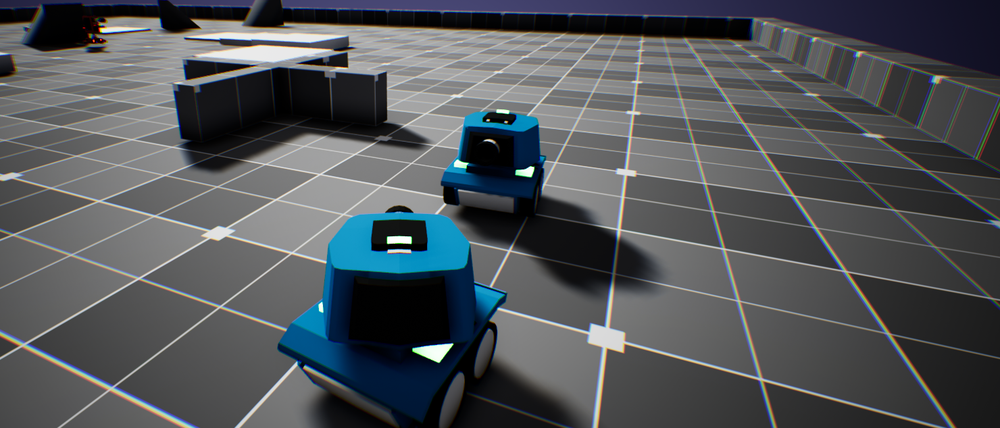
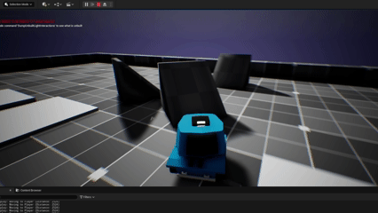

# ToonTank Enhanced Edition
> A UE5-based tank combat system, originally built from the tutorial *Learn C++ from scratch while making 4 fun games in Unreal Engine*. After completing the tutorial, the project has undergone multiple rounds of architectural refactoring and feature expansion.

## 🎮 Project Showcase

*Figure 1: Cover*

*Figure 2: Tank sliding on a slope*

*Figure 3: Enemy spawning, AiController and MovementComponent*

For Chineses README [ClickHere](DevLogs/DevLog_CHver.md)

## 📋 Project Overview
This is a learning-oriented project, mainly aimed at exploring various UE5 features. After finishing the tutorial (which originally only included NPC logic and GameMode), I gradually added the following functionalities (through consulting AI or official documentation):
- Input system refactoring (Enhanced Input System)
- Refactored coupling logic: separated Controller and Pawn, allowing AI and Player to share control logic (value injection)
- Enemy spawning and wave system (refactored GameMode victory conditions and counters)

**Development Period**: 2025/07 – ongoing  
**UE Version**: 5.5

## 📖 Dev Log
Detailed technical decisions, troubleshooting, and learning notes can be found in [DEVLOG.md](DevLogs/DevLog.md)

## 🛠 Technical Implementation

### 1. Enhanced Input System Integration
- Refactored from legacy Input to Enhanced Input
- Rebuilt and handled input interfaces for AI Controller and Player Controller
- AI Controller implemented based on the turret-type enemy base class, allowing shared logic between Tank/Tower

### 2. Enemy Spawning System
- Utilized Multicast Delegate + Factory Pattern to simplify dependencies
- Dynamically scanned ground height to avoid collisions

### 3. Physics-Based Movement System
- Custom Movement Component handling slope climbing and AI navigation logic, shared by Player and AI
- Implemented UNavMovementComponent, simulating UPawnMovementComponent input logic
- Applied vector math to achieve Pitch Align Slope (tank body rotates according to slope)
- Solved Spring Arm relative/world coordinate conversion issues

### 4. Gameplay Ability System (GAS)
- Integrated ASC, AttributeSet, and Gameplay Ability
- Implemented laser weapon (Line Trace). TODO: combine with projectile system for switchable modes
- Configured Cost system (ammo consumption)

## 🛠️ Tech Stack
- **Engine**: Unreal Engine 5.5  
- **Languages**: C++ + Blueprint  
- **Core Systems**:  
  - Enhanced Input System  
  - Gameplay Ability System (deployed successfully following official docs)  
  - Custom Movement Component  
  - AI Controller (implemented) + Behavior Tree (planned learning)  

## 🎯 Learning Outcomes
- Understanding UE5 Delegate mechanism and decoupled design
- Mastering basic GAS workflow and integration
- Practicing refactoring and architectural improvements (from single responsibility to modular design)
- Developing the habit of writing dev logs
- Applying vector math in gameplay systems

## 🚧 Known Issues & Improvements
- Health Component not yet migrated to GAS AttributeSet
- Weapon system planned to be switchable
- AI decision logic pending expansion (Behavior Tree)
- ~~SpringArm rotates incorrectly when climbing slopes~~
- ~~Tank turns oddly toward world X-axis positive~~
- AI pathfinding occasionally results in crab-like movement
- Spawn system sometimes stacks enemies unnaturally

**Controls**:  
- MOUSE & KEYBOARD  
- WASD: Movement  
- Mouse: Aim / Rotate turret  
- Left Click: Fire  

---

## 💡 Development Notes
This is my UE5 learning project built from scratch. After completing the official tutorial, I continued expanding its features.  
Throughout the process, I performed multiple refactorings, gradually evolving from tightly coupled code to modular design, gaining deep appreciation for the importance of architecture in project maintenance.  

**Biggest takeaway**: Learning to achieve decoupled design through mechanisms like Delegate and Interface.  

**Ongoing updates** | Feedback and suggestions are welcome
